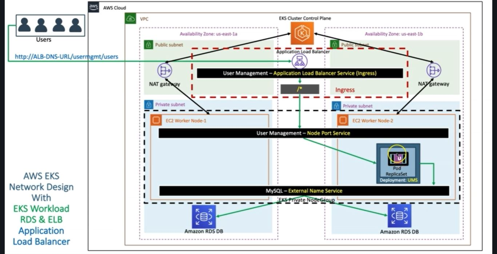

# AWS ALB Load Balancer Controller - Basics

## Step-01: Introduction

- Application Architecture which we are going to deploy is given below:



## Step-02: Foundation Section

### Create ALB Manually for additional understanding

- Create a simple Application Load Balancer and understand the following
- Application Load Balancer Core Concepts
  - ALB should be **Internet** facing or **Internal**
  - Listeners (Default HTTP 80)
  - Rules (HTTP /\*)
  - Target Groups
    - Targets (Backends) (Many target groups can be added. 1-n relationship between ALB<->TargetGroup)
    - HealthCheck Settings
      - Protocol: HTTP
      - Traffic Port (8095)
      - Health Check Path: /usermgmt/health-status
      - Success Codes: 200
      - Health check many other settings
- Delete the Load Balancer & TG.

### Understand about ALB Ingress Annotations

- Understand about ALB Ingress Annotations.
- **Reference:** https://github.com/kubernetes-sigs/aws-load-balancer-controller/blob/main/docs/guide/ingress/annotations.md

## Step-03: Create ALB kubernetes basic Ingress Manifest

- Create a basic ALB Ingress template.
- **05-ALB-Ingress-Basic.yml**

```yml
# Annotations Reference:  https://github.com/kubernetes-sigs/aws-load-balancer-controller/blob/main/docs/guide/ingress/annotations.md
apiVersion: extensions/v1beta1
kind: Ingress
metadata:
  name: ingress-usermgmt-restapp-service
  labels:
    app: usermgmt-restapp
  annotations:
    # Ingress Core Settings
    kubernetes.io/ingress.class: "alb"
    alb.ingress.kubernetes.io/scheme: internet-facing
    # Health Check Settings
    alb.ingress.kubernetes.io/healthcheck-protocol: HTTP
    alb.ingress.kubernetes.io/healthcheck-port: traffic-port
    alb.ingress.kubernetes.io/healthcheck-path: /usermgmt/health-status
    alb.ingress.kubernetes.io/healthcheck-interval-seconds: "15"
    alb.ingress.kubernetes.io/healthcheck-timeout-seconds: "5"
    alb.ingress.kubernetes.io/success-codes: "200"
    alb.ingress.kubernetes.io/healthy-threshold-count: "2"
    alb.ingress.kubernetes.io/unhealthy-threshold-count: "2"
spec:
  rules:
    - http:
        paths:
          - path: /*
            backend:
              serviceName: usermgmt-restapp-nodeport-service
              servicePort: 8095
```

## Step-04: Deploy Application with ALB Ingress Template included

```
# Deploy Application with ALB Template
kubectl apply -f kube-manifests/

# Verify our UMS App is UP and Running
kubectl get pods
kubectl logs -f <pod-name>
kubectl logs -f usermgmt-microservice-5c89458797-xsb64

# Get List of Ingress  (Make a note of Address field)
kubectl get ingress

# List Services
kubectl get svc

# Describe Ingress Controller
kubectl describe ingress ingress-usermgmt-restapp-service

# Verify ALB Ingress Controller logs
kubectl logs -f $(kubectl get po -n kube-system | egrep -o 'alb-ingress-controller-[A-Za-z0-9-]+') -n kube-system
```

- We should not see anything like below log in ALB Ingress Controller log, if we see we did something wrong with ALB Ingress Controleer deployment primarily in creating IAM Policy, Service Account & Role and Associating Role to Service Account.

```log
07:28:39.900001       1 controller.go:217] kubebuilder/controller "msg"="Reconciler error" "error"="failed to build LoadBalancer configuration due to unable to fetch subnets. Error: WebIdentityErr: failed to retrieve credentials\ncaused by: AccessDenied: Not authorized to perform sts:AssumeRoleWithWebIdentity\n\tstatus code: 403, request id: 3d54741a-4b85-4025-ad11-73d4a3661d09"  "controller"="alb-ingress-controller" "request"={"Namespace":"default","Name":"ingress-usermgmt-restapp-service"}
```

## Step-05: Verify the ALB in AWS Management Console & Access Application using ALB DNS URL

- Verify Load Balancer
  - In Listeners Tab, click on **View/Edit Rules** under Rules
- Verify Target Groups
  - GroupD Details
  - Targets: Ensure they are healthy
- Access Application

```
http://<ALB-DNS-URL>/usermgmt/health-status
```

## Step-06: Clean Up

```
kubectl delete -f kube-manifests/
```
