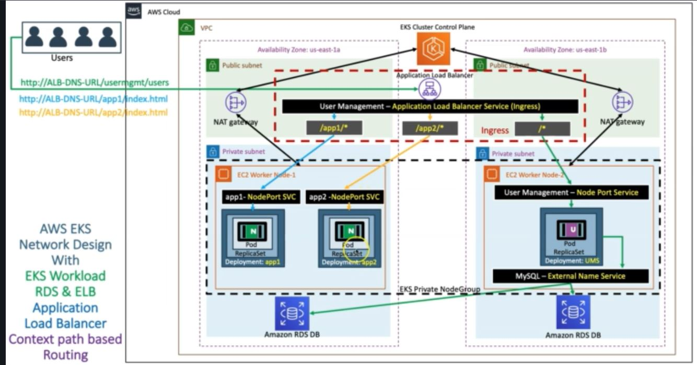

# AWS ALB Load Balancer Controller - Context Path Based Routing

## Step-01: Introduction

- Application Architecture which we are going to deploy is given below:

  

- We are going to create two more apps with static pages in addition to UMS.
  - App1 with context as /app1 - Simple Nginx custom built image
  - App2 with context as /app2 - Simple Nginx custom built image
- We are going to deploy all these 3 apps in kubernetes with context path based routing enabled in Ingress Controller
  - /app1/\* - should go to app1-nginx-nodeport-service
  - /app2/\* - should go to app2-nginx-nodeport-service
  - /\* - should go to sermgmt-restapp-nodeport-service
- As part of this process, this respective annotation `alb.ingress.kubernetes.io/healthcheck-path: /usermgmt/health-status` will be moved to respective application NodePort Service. Only generic settings will be present in Ingress manifest annotations area `07-ALB-Ingress-ContextPath-Based-Routing.yml`

## Step-02: Create Nginx App1 & App2 Deployment & Service

- **App1 Nginx:** 05-Nginx-App1-Deployment-and-NodePortService.yml
- **App2 Nginx:** 06-Nginx-App2-Deployment-and-NodePortService.yml

## Step-03: Update Health Check Path Annotation in User Management Node Port Service

- Health check path annotation should be moved to respective node port services if we have to route to multiple targets using single load balancer.
- **04-UserManagement-NodePort-Service.yml**

```yml
#Important Note:  Need to add health check path annotations in service level if we are planning to use multiple targets in a load balancer
alb.ingress.kubernetes.io/healthcheck-path: /usermgmt/health-status
```

## Step-04: Create ALB Ingress Context path based Routing Kubernetes manifest

- **07-ALB-Ingress-ContextPath-Based-Routing.yml**

```yml
# Annotations Reference:  https://github.com/kubernetes-sigs/aws-load-balancer-controller/blob/main/docs/guide/ingress/annotations.md
apiVersion: extensions/v1beta1
kind: Ingress
metadata:
  name: ingress-usermgmt-restapp-service
  labels:
    app: usermgmt-restapp
  annotations:
    # Ingress Core Settings
    kubernetes.io/ingress.class: "alb"
    alb.ingress.kubernetes.io/scheme: internet-facing
    # Health Check Settings
    alb.ingress.kubernetes.io/healthcheck-protocol: HTTP
    alb.ingress.kubernetes.io/healthcheck-port: traffic-port
    #Important Note:  Need to add health check path annotations in service level if we are planning to use multiple targets in a load balancer
    #alb.ingress.kubernetes.io/healthcheck-path: /usermgmt/health-status
    alb.ingress.kubernetes.io/healthcheck-interval-seconds: "15"
    alb.ingress.kubernetes.io/healthcheck-timeout-seconds: "5"
    alb.ingress.kubernetes.io/success-codes: "200"
    alb.ingress.kubernetes.io/healthy-threshold-count: "2"
    alb.ingress.kubernetes.io/unhealthy-threshold-count: "2"
spec:
  rules:
    - http:
        paths:
          - path: /app1/*
            backend:
              serviceName: app1-nginx-nodeport-service
              servicePort: 80
          - path: /app2/*
            backend:
              serviceName: app2-nginx-nodeport-service
              servicePort: 80
          - path: /*
            backend:
              serviceName: usermgmt-restapp-nodeport-service
              servicePort: 8095
# Important Note-1: In path based routing order is very important, if we are going to use  "/*", try to use it at the end of all rules.
```

## Step-05: Deploy all manifests and test

- **Deploy**

```
kubectl apply -f kube-manifests/
```

- **Verify ingress resource got created**

```
# List Ingress Load Balancers
kubectl get ingress

# List Pods
kubectl get pods

# List Services
kubectl get svc
```

- **Verify ALB Load Balancer Controller Logs**

```
# Verify logs
kubectl logs -f $(kubectl get po -n kube-system | egrep -o 'alb-ingress-controller-[A-Za-z0-9-]+') -n kube-system
```

- We should not see anything like below log in ALB Load Balancer Controller, if we see we did something wrong with ALB Load Balancer Controller deployment primarily in creating IAM Policy, Service Account & Role and Associating Role to Service Account.

```log
07:28:39.900001       1 controller.go:217] kubebuilder/controller "msg"="Reconciler error" "error"="failed to build LoadBalancer configuration due to unable to fetch subnets. Error: WebIdentityErr: failed to retrieve credentials\ncaused by: AccessDenied: Not authorized to perform sts:AssumeRoleWithWebIdentity\n\tstatus code: 403, request id: 3d54741a-4b85-4025-ad11-73d4a3661d09"  "controller"="alb-ingress-controller" "request"={"Namespace":"default","Name":"ingress-usermgmt-restapp-service"}
```

- **Verify Application Load Balancer on AWS Management Console**
- Verify Load Balancer
  - In Listeners Tab, click on **View/Edit Rules** under Rules
- Verify Target Groups

  - GroupD Details
  - Targets: Ensure they are healthy
  - Verify Health check path
  - Verify all 3 targets are healthy - Each application deployed corresponds to a Target Group.
  - Each Target Group contains list of EC2 instance Ids, their NodePort, Zones, Status.

- **Access Application**

```
http://<ALB-DNS-URL>/app1/index.html
http://<ALB-DNS-URL>/app2/index.html
http://<ALB-DNS-URL>/usermgmt/health-status
```

## Step-06: Clean Up

```
kubectl delete -f kube-manifests/
```
