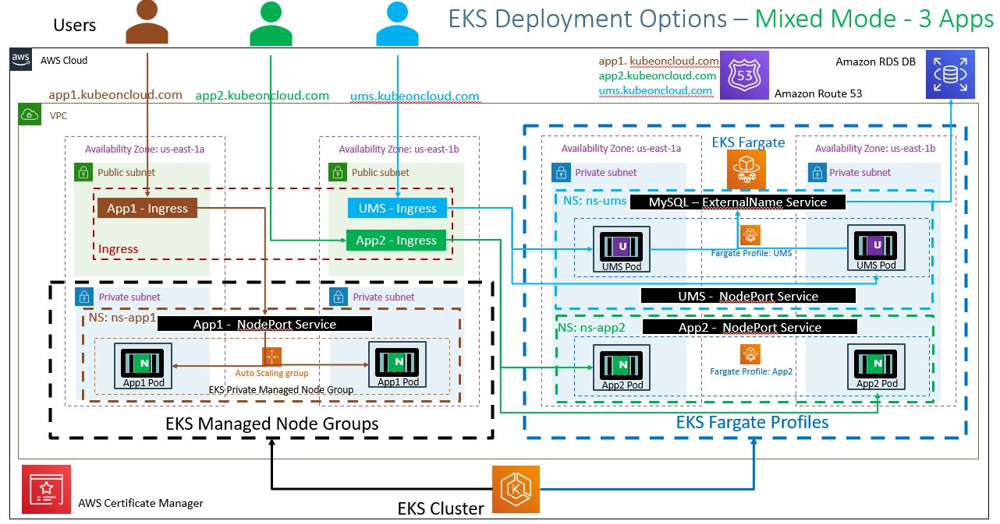

# EKS Mixed Mode Deployment - 3 Apps

## Step-01: What are we going to learn?

- We are going to learn about writing Fargate Profiles using YAML wherein with YAML we can create multiple fargate profiles at a time.
- Understand about `namespaces and labels` in `fargate profiles`
- Deploy 3 Apps in a mixed Mode
  - 2 Apps to 2 different Fargate Profiles
  - 1 App to EKS EC2 Manged Node Group
- Test and clean-up

### Architecture



- There are 3 Ingress objects created for each application belong to their respective Namespaces.
- `Ingress with Cross Namespaces is not supported. So we can't have a Single Ingress which can route traffic across applications that belong to different namespaces using Path or Host based routing`.
- Applications belong to same Namespace can be handled with single Ingress with either Path or Host based routing.

## Step-02: Create Advanced Fargate Profile with yml

### Create Fargate Profile manifest

```yml
apiVersion: eksctl.io/v1alpha5
kind: ClusterConfig
metadata:
  name: eksdemo1 # Name of the EKS Cluster
  region: eu-west-1
fargateProfiles:
  - name: fp-app2
    selectors:
      # All workloads in the "ns-app2" Kubernetes namespace will be
      # scheduled onto Fargate:
      - namespace: ns-app2
  - name: fp-ums
    selectors:
      # All workloads in the "ns-ums" Kubernetes namespace matching the following
      # label selectors will be scheduled onto Fargate:
      - namespace: ns-ums
        labels:
          runon: fargate
```

## Step-03: Create Fargate Profiles using YAML files

```
# Create Fargate Profiles using YAML file
eksctl create fargateprofile -f kube-manifests/01-Fargate-Advanced-Profiles/01-fargate-profiles.yml
```

## Step-04: Get list of Fargate profiles

```
# List Fargate profiles
eksctl get fargateprofile --cluster eksdemo1

# View in yaml format
eksctl get fargateprofile --cluster eksdemo1 -o yaml
```

## Step-05: Review App1, App2 and UMS Manifests

- Review Namespaces
  - ns-app1
  - ns-app2
  - ns-ums
- Discuss about label present in `ns-ums` namespace

```yml
- namespace: ns-ums
  labels:
    runon: fargate
```

- Discuss about target-type

```yml
# For Fargate
alb.ingress.kubernetes.io/target-type: ip
```

## Step-06: Deploy Apps

- **Pre-requisite Check:** Verify if RDS DB which is required for UMS Service is UP and RUNNING.

```
# Deploy Apps
kubectl apply -R -f kube-manifests/02-Applications/
```

## Step-07: Verify deployed Apps

### Verify using kubectl

```
# Verify Ingress
kubectl get ingress --all-namespaces

# Verify Pods
kubectl get pods --all-namespaces -o wide

# Verify Fargate Nodes
kubectl get nodes -o wide
```

### Verify ALB & Target Groups

- Verify ALB Listeneres, Rules
- Verify Target Groups
  - App1: Should use Target Type as `instance`
  - App2, UMS: Should use Target Type as `ip`

### Access Applications

- nslookup app1.awseksstudy.com
- nslookup app2.awseksstudy.com
- nslookup ums.awseksstudy.com

- nslookup app1-alb-dns-name
- nslookup app2-alb-dns-name
- nslookup ums-alb-dns-name

Note: The `nslookup app1.awseksstudy.com & nslookup app1-alb-dns-name` should return same IP addresses. The same is applicable for app2 and ums.

- App1: http://app1.awseksstudy.com/app1/index.html
- App2: http://app2.awseksstudy.com/app2/index.html
- UMS Health Status Page: http://ums.awseksstudy.com/usermgmt/health-status
- UMS List Users: http://ums.awseksstudy.com/usermgmt/users

## Step-08: Delete Apps

```
# delete Apps
kubectl delete -R -f kube-manifests/02-Applications/
```

## Step-09: Delete Fargate Profile

```
# Get list of Fargate Profiles in a cluster
eksctl get fargateprofile --cluster eksdemo1

# Delete Fargate Profile
eksctl delete fargateprofile --cluster <cluster-name> --name <Fargate-Profile-Name> --wait
eksctl delete fargateprofile --cluster eksdemo1 --name fp-app2 --wait
eksctl delete fargateprofile --cluster eksdemo1 --name fp-ums --wait

```

## Reference github Issue for ALB Ingress with Cross Namespaces

- https://github.com/kubernetes/kubernetes/issues/17088
