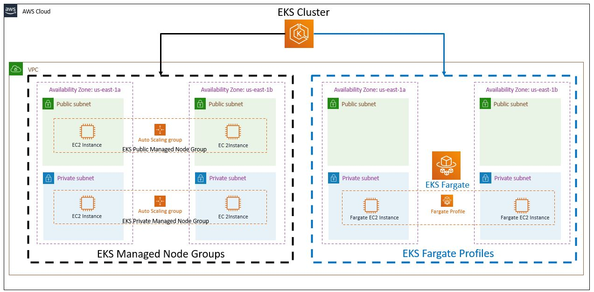

# AWS EKS - Fargate Profiles

## EKS with Managed Nodes and Fargate

## AWS Fargate

- Fargate is a `Serverless Compute Platform` for containers on AWS.
- Fargate provides `on-demand, right-sized compute capacity` for containers.
- EKS integrates K8s with Fargate by using `Controllers that are built by AWS using the upstream, extensible model` provided by K8s.
- These Controllers run as part of the `EKS managed k8s control plane` and are responsible for scheduling native k8s pods onto Fargate.
- The `Fargate Controllers include new Scheduler` that runs alongside the default k8s Scheduler in addition to several mutating and validation admission controllers.
- When we start a pod that meets the criteria for running a Fargate, the Fargate Controllers running in the cluster recognize, update and schedule the pod on Fargate.

## AWS EKS on Fargate

- Bringing Existing Pods:
  - We can bring existing pods and run on Fargate without any changes to them.
  - Fargate works with existing workflows and services that run on k8s.
- Production Ready
  - Launch pods easily.
  - Easily run pods across AZs for HA.
  - Each pod runs in an isolated compute environment. 1 pod = 1 EC2 fargate instance which is actually a worker node.
- Right sized and Integrated
  - Only Pay for resources you need to run your pods.
  - Includes native AWS integrations for networking and security.
- In EKS Fargate profiles, the organisation of applications are with k8s namespace level.

## EKS Fargate considerations

- There are many considerations we need to be aware of before we decide our k8s workloads to run on Fargate.
- https://docs.aws.amazon.com/eks/latest/userguide/fargate.html

## Topics

1. Fargate Profiles - Basic
2. Fargate Profiles - Advanced using YAML

## References

- https://eksctl.io/usage/fargate-support/
- https://docs.aws.amazon.com/eks/latest/userguide/fargate.html
- https://github.com/kubernetes-sigs/aws-load-balancer-controller/blob/main/docs/guide/ingress/annotations.md#target-type
