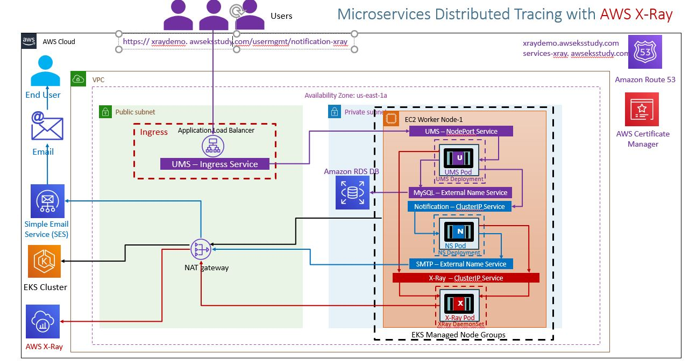

# Microservices Distributed Tracing with X-Ray on AWS EKS

## Step-01: Introduction

### Introduction to AWS XRay & k8s DaemonSets

#### Understand about AWS X-Ray Services

- Helps to `analyse and debug` distributed applications built using microservices architecture.
- With X-Ray, we can understand how the application and its underlying services are performing to `identify and troubleshoot the root cause of performance issues and errors`.
- X-Ray provides an `end-to-end view of requests` as they travel through our application and shows a map of our application's underlying components.
- We can also use X-Ray to analyse applications in development and in production, from `simple web tier applications to complex microservices applications` consisting of thousands of services.

#### Understand Kubernetes DaemonSets

- A DaemonSet ensures that all (or some) Nodes run a copy of a Pod.
  - As nodes are added to the cluster, Pods are added to them.
  - As nodes are removed from the cluster, those Pods are garbage collected.
  - Deleting a DaemonSet will cleanup the Pods it created.
- Some typical uses of DaemonSet are:
  - Running a logs collection daemon on every node. Example: fluentd
  - Running a node monitoring daemon on every node. Example: cloudwatchagent
  - Running a application trace collection daemon on every node. Example: AWS X-Ray
- In a simple case, one DaemonSet, covering all nodes would be used for each type of daemon.
- A more complex setup might use multiple DaemonSets for a single type of daemon, but with different flags and/or different memory and cpu requests for different hardware types.

#### Understand the AWS X-Ray and Microservices network design on EKS Cluster

- AWS X-Ray is deployed as DaemonSet on EKS cluster. It creates X-Ray pods on each worker nodes and expose those Pods via X-Ray ClusterIP Service.
  

#### Understand about Service Map, Traces and Segments in AWS X-Ray

- Use AWS X-Ray SDK
- Configure EC2, EKS plugins for X-Ray Recorder API to get more details on EC2, EKS details in the traces.

### Usecase Description

- User Management **getNotificationAppInfo** will call Notification service **notification-xray** which will evetually send traces to AWS X-Ray service
- We are going to depict one Microservice calling other Microservice

### List of Docker Images used in this section

| Application Name              | Docker Image Name                                                     |
| ----------------------------- | --------------------------------------------------------------------- |
| User Management Microservice  | stacksimplify/kube-usermanagement-microservice:3.0.0-AWS-XRay-MySQLDB |
| Notifications Microservice V1 | stacksimplify/kube-notifications-microservice:3.0.0-AWS-XRay          |

## Step-02: Pre-requisite: AWS RDS Database, ALB Ingress Controller & External DNS

### AWS RDS Database

- We have created AWS RDS Database as part of section [06-EKS-Storage-with-RDS-Database](/06-EKS-Storage-with-RDS-Database/README.md)
- We even created a `externalName service: 01-MySQL-externalName-Service.yml` in our Kubernetes manifests to point to that RDS Database.

### ALB Ingress Controller & External DNS

- We are going to deploy a application which will also have a `ALB Ingress Service` and also will register its DNS name in Route53 using `External DNS`
- Which means we should have both related pods running in our EKS cluster.
- We have installed **ALB Ingress Controller** as part of section [06-01-ALB-Ingress-Install](/06-ELB-Application-LoadBalancers/08-01-ALB-Ingress-Install/README.md)
- We have installed **External DNS** as part of section [06-06-01-Deploy-ExternalDNS-on-EKS](/06-ELB-Application-LoadBalancers/06-06-ALB-Ingress-ExternalDNS/06-06-01-Deploy-ExternalDNS-on-EKS/README.md)

```
# Verify alb-ingress-controller pod running in namespace kube-system
kubectl get pods -n kube-system

# Verify external-dns pod running in default namespace
kubectl get pods
```

## Step-03: Create IAM permissions for AWS X-Ray daemon

```
# Template
eksctl create iamserviceaccount \
    --name service_account_name \
    --namespace service_account_namespace \
    --cluster cluster_name \
    --attach-policy-arn arn:aws:iam::aws:policy/AWSXRayDaemonWriteAccess \
    --approve \
    --override-existing-serviceaccounts

# Replace Name, Namespace, Cluster Info (if any changes)
eksctl create iamserviceaccount \
    --name xray-daemon \
    --namespace default \
    --cluster eksdemo1 \
    --attach-policy-arn arn:aws:iam::aws:policy/AWSXRayDaemonWriteAccess \
    --approve \
    --override-existing-serviceaccounts
```

### Verify Service Account and AWS IAM Role

```
# List k8s Service Accounts
kubectl get sa

# Describe Service Account (Verify IAM Role annotated)
kubectl describe sa xray-daemon

# List IAM Roles on eksdemo1 Cluster created with eksctl
eksctl  get iamserviceaccount --cluster eksdemo1
```

## Step-04: Update IAM Role ARN in xray-k8s-daemonset.yml

### Get AWS IAM Role ARN for xray-daemon

```
# Get AWS IAM Role ARN
eksctl  get iamserviceaccount xray-daemon --cluster eksdemo1
```

### Update xray-k8s-daemonset.yml

- File Name: kube-manifests/01-XRay-DaemonSet/xray-k8s-daemonset.yml

```yml
apiVersion: v1
kind: ServiceAccount
metadata:
  labels:
    app: xray-daemon
  name: xray-daemon
  namespace: default
  # Update IAM Role ARN created for X-Ray access
  annotations:
    eks.amazonaws.com/role-arn: arn:aws:iam::180789647333:role/eksctl-eksdemo1-addon-iamserviceaccount-defa-Role1-20F5AWU2J61F
```

### Deploy X-Ray DaemonSet on our EKS Cluster

```
# Deploy
kubectl apply -f kube-manifests/01-XRay-DaemonSet/xray-k8s-daemonset.yml

# Verify Deployment, Service & Pod
kubectl get deploy,svc,pod

# Verify X-Ray Logs
kubectl logs -f <X-Ray Pod Name>
kubectl logs -f xray-daemon-phszp

# List & Describe DaemonSet
kubectl get daemonset
kubectl describe daemonset xray-daemon
```

## Step-05: Review Microservices Application Deployment Manifests

- **02-UserManagementMicroservice-Deployment.yml**

```yml
# Change-1: Image Tag is 3.0.0-AWS-XRay-MySQLDB
      containers:
        - name: usermgmt-restapp
          image: stacksimplify/kube-usermanagement-microservice:3.0.0-AWS-XRay-MySQLDB

# Change-2: New Environment Variables related to AWS X-Ray
            - name: AWS_XRAY_TRACING_NAME
              value: "User-Management-Microservice"
            - name: AWS_XRAY_DAEMON_ADDRESS
              value: "xray-service.default:2000"
            - name: AWS_XRAY_CONTEXT_MISSING
              value: "LOG_ERROR"  # Log an error and continue, Ideally RUNTIME_ERROR – Throw a runtime exception which is default option if not configured
```

- **04-NotificationMicroservice-Deployment.yml**

```yml
# Change-1: Image Tag is 3.0.0-AWS-XRay
    spec:
      containers:
        - name: notification-service
          image: stacksimplify/kube-notifications-microservice:3.0.0-AWS-XRay

# Change-2: New Environment Variables related to AWS X-Ray
            - name: AWS_XRAY_TRACING_NAME
              value: "V1-Notification-Microservice"
            - name: AWS_XRAY_DAEMON_ADDRESS
              value: "xray-service.default:2000"
            - name: AWS_XRAY_CONTEXT_MISSING
              value: "LOG_ERROR"  # Log an error and continue, Ideally RUNTIME_ERROR – Throw a runtime exception which is default option if not configured

```

## Step-06: Review Ingress Manifest

- **07-ALB-Ingress-SSL-Redirect-ExternalDNS.yml**

```yml
# Change-1: Update with your SSL Cert ARN when using template
alb.ingress.kubernetes.io/certificate-arn: arn:aws:acm:eu-west-1:180789647333:certificate/9f042b5d-86fd-4fad-96d0-c81c5abc71e1

# Change-2: Update with your "yourdomainname.com"
# External DNS - For creating a Record Set in Route53
external-dns.alpha.kubernetes.io/hostname: services-xray.awseksstudy.com, xraydemo.awseksstudy.com
```

## Step-07: Deploy Manifests

```
# Deploy
kubectl apply -f kube-manifests/02-Applications

# Verify
kubectl get pods
```

## Step-08: Test

```
# Test
https://services-xray.awseksstudy.com/usermgmt/notification-xray
https://xraydemo.awseksstudy.com/usermgmt/notification-xray

# Your Domain Name
https://<Replace-your-domain-name>/usermgmt/notification-xray
```

## Step-09: Clean-Up

- We are going to delete applications created as part of this section
- We are going to leave the xray daemon set running which we will leverage in our next section canary deployments in Kubernetes on EKS.

```
# Delete Apps
kubectl delete -f kube-manifests/02-Applications
```

## References

- https://github.com/aws-samples/aws-xray-kubernetes/
- https://github.com/aws-samples/aws-xray-kubernetes/blob/master/xray-daemon/xray-k8s-daemonset.yaml
- https://aws.amazon.com/blogs/compute/application-tracing-on-kubernetes-with-aws-x-ray/
- https://docs.aws.amazon.com/xray/latest/devguide/xray-sdk-java-configuration.html
- https://docs.aws.amazon.com/xray/latest/devguide/xray-sdk-java-configuration.html#xray-sdk-java-configuration-plugins
- https://docs.aws.amazon.com/xray/latest/devguide/xray-sdk-java-httpclients.html
- https://docs.aws.amazon.com/xray/latest/devguide/xray-sdk-java-filters.html
- https://docs.aws.amazon.com/xray/latest/devguide/xray-sdk-java-sqlclients.html
