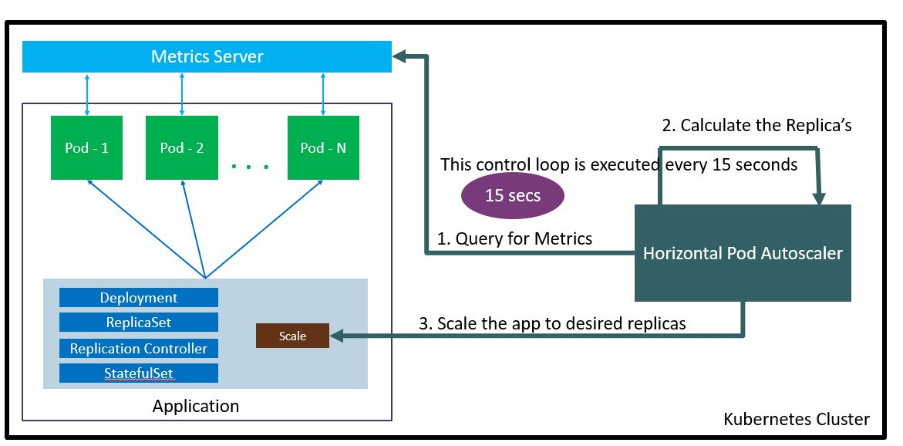

# EKS - Horizontal Pod Autoscaling (HPA)

## Step-01: Introduction

- What is Horizontal Pod Autoscaling?
  - Horizontal Scaling means increasing or decreasing number of Replicas(Pods)
  - HPA automatically scales the number of pods in a Deployment, Replication Controller, ReplicaSet, StatefulSet on the resource's CPU or other metrics utilization.
  - This can help out applications to scale out to meet increased demand or scale in when resources are not needed, thus freeing up worker nodes for other applications.
  - When we set target CPU utilization percentage, HPA scales the application in or out to try to meet that target.
  - HPA needs K8s metrics server to verify CPU metrics of a Pod.
  - We do not need to install HPA on the cluster to begin scaling our applications. Its supported by default as K8s API resource.
- How HPA Works?
  

## Step-02: Install Metrics Server

```
# Verify if Metrics Server already Installed
kubectl -n kube-system get deployment/metrics-server

# Install Metrics Server
kubectl apply -f https://github.com/kubernetes-sigs/metrics-server/releases/download/v0.4.2/components.yaml

# Verify
kubectl get deployment metrics-server -n kube-system
```

## Step-03: Review Deploy our Application

```
# Deploy
kubectl apply -f kube-manifests/

# List Pods, Deploy & Service
kubectl get pod,svc,deploy

# Access Application (Only if our Cluster is Public Subnet)
kubectl get nodes -o wide
http://<Worker-Node-Public-IP>:31231
```

## Step-04: Create a Horizontal Pod Autoscaler resource for the "hpa-demo-deployment"

- This command creates an autoscaler that targets 50 percent CPU utilization for the deployment, with a minimum of one pod and a maximum of ten pods.
- When the average CPU load is below 50 percent, the autoscaler tries to reduce the number of pods in the deployment, to a minimum of one.
- When the load is greater than 50 percent, the autoscaler tries to increase the number of pods in the deployment, up to a maximum of ten.

```
# Template
kubectl autoscale deployment <deployment-name> --cpu-percent=50 --min=1 --max=10

# Replace
kubectl autoscale deployment hpa-demo-deployment --cpu-percent=50 --min=1 --max=10

# Describe HPA
kubectl describe hpa/hpa-demo-deployment

# List HPA
kubectl get horizontalpodautoscaler.autoscaling/hpa-demo-deployment
```

## Step-05: Create the load & Verify how HPA is working

```
# Generate Load
kubectl run --generator=run-pod/v1 apache-bench -i --tty --rm --image=httpd -- ab -n 500000 -c 1000 http://hpa-demo-service-nginx.default.svc.cluster.local/

# List all HPA
kubectl get hpa

# List specific HPA
kubectl get hpa hpa-demo-deployment

# Describe HPA
kubectl describe hpa/hpa-demo-deployment

# List Pods
kubectl get pods
```

## Step-06: Cooldown / Scaledown

- Default cooldown period is 5 minutes.
- Once CPU utilization of pods is less than 50%, it will start terminating pods and will reach to minimum 1 pod as configured.

## Step-07: Clean-Up

```
# Delete HPA
kubectl delete hpa hpa-demo-deployment

# Delete Deployment & Service
kubectl delete -f kube-manifests/
```

## Step-08: Imperative vs Declarative for HPA

- From Kubernetes v1.18 onwards, we have a declarative way of defining HPA policies using `behavior` object in yaml.
- **Support for configurable scaling behavior**
  - Starting from v1.18 the v2beta2 API allows scaling behavior to be configured through the HPA behavior field.
  - Behaviors are specified separately for scaling up and down in scaleUp or scaleDown section under the behavior field

```yml
behavior:
  scaleDown:
    stabilizationWindowSeconds: 300
    policies:
      - type: Percent
        value: 100
        periodSeconds: 15
  scaleUp:
    stabilizationWindowSeconds: 0
    policies:
      - type: Percent
        value: 100
        periodSeconds: 15
      - type: Pods
        value: 4
        periodSeconds: 15
    selectPolicy: Max
```

- **Reference:** Select V1.18 from top right corner on Kubernetes website for V1.18 documentation
  - https://kubernetes.io/docs/tasks/run-application/horizontal-pod-autoscale/

## Referencess

### Metrics Server Releases

- https://github.com/kubernetes-sigs/metrics-server/releases

### Horizontal Pod Autoscaling - Scale based on many type of metrics

- https://kubernetes.io/docs/tasks/run-application/horizontal-pod-autoscale-walkthrough/
