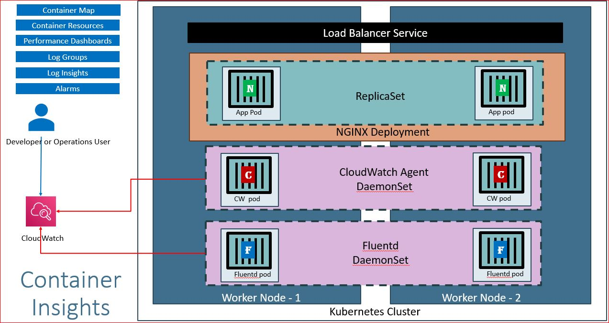

# Monitoring EKS using CloudWatch Container Insigths

## Step-01: Introduction

- What are CloudWatch Container Insights?

  - A `fully managed observability service` for monitoring, troubleshooting and alarming on containerized applications.
  - Container Insights allow us to `collect, aggregate and summarize metrics and logs` from our containerized applications and microservices.
  - The metrics include utilization of resources such as `CPU, memory, disk and network`.
  - It also provides `diagnostic information` such as container restart failures, to help us isolate issues and resolve them quickly.
  - We can also set `CloudWatch alarms` on metrics that Container Insights collects.
  - The metrics that Container Insights collects are available in `CloudWatch automatic dashboards`.
  - We can analyze and troubleshoot container performance and logs data with `CloudWatch Logs Insights`.

- What is CloudWatch Agent and Fluentd?

  - Fluentd Agent - It collects application logs, cluster logs and push to CloudWatch
  - CloudWatch Agent - It collects metrics of application and cluster.

  

## Step-02: Associate CloudWatch Policy to our EKS Worker Nodes Role

- Go to Services -> EC2 -> Worker Node EC2 Instance -> IAM Role -> Click on that role

```
# Sample Role ARN
arn:aws:iam::180789647333:role/eksctl-eksdemo1-nodegroup-eksdemo-NodeInstanceRole-1FVWZ2H3TMQ2M

# Policy to be associated
Associate Policy: CloudWatchAgentServerPolicy
```

## Step-03: Install Container Insights

### Deploy CloudWatch Agent and Fluentd as DaemonSets

- This command will
  - Creates the Namespace amazon-cloudwatch.
  - Creates all the necessary security objects for both DaemonSet:
    - SecurityAccount
    - ClusterRole
    - ClusterRoleBinding
  - Deploys `Cloudwatch-Agent` (responsible for sending the metrics to CloudWatch) as a DaemonSet.
  - Deploys fluentd (responsible for sending the logs to Cloudwatch) as a DaemonSet.
  - Deploys ConfigMap configurations for both DaemonSets.

```
# Template
curl -s https://raw.githubusercontent.com/aws-samples/amazon-cloudwatch-container-insights/latest/k8s-deployment-manifest-templates/deployment-mode/daemonset/container-insights-monitoring/quickstart/cwagent-fluentd-quickstart.yaml | sed "s/{{cluster_name}}/<REPLACE_CLUSTER_NAME>/;s/{{region_name}}/<REPLACE-AWS_REGION>/" | kubectl apply -f -

# Replaced Cluster Name and Region
curl -s https://raw.githubusercontent.com/aws-samples/amazon-cloudwatch-container-insights/latest/k8s-deployment-manifest-templates/deployment-mode/daemonset/container-insights-monitoring/quickstart/cwagent-fluentd-quickstart.yaml | sed "s/{{cluster_name}}/eksdemo1/;s/{{region_name}}/eu-west-1/" | kubectl apply -f -
```

## Verify

```
# List Daemonsets
kubectl -n amazon-cloudwatch get daemonsets
```

## Step-04: Deploy Sample Nginx Application

```
# Deploy
kubectl apply -f kube-manifests
```

## Step-05: Generate load on our Sample Nginx Application

```
# Generate Load
kubectl run --generator=run-pod/v1 apache-bench -i --tty --rm --image=httpd -- ab -n 500000 -c 1000 http://sample-nginx-service.default.svc.cluster.local/
```

## Step-06: Access CloudWatch Dashboard

- Access CloudWatch Container Insights Dashboard
  

## Step-07: CloudWatch Log Insights

- View Container logs
- View Container Performance Logs

## Step-08: Container Insights - Log Insights in depth

- Log Groups
- Log Insights
- Create Dashboard

### Create Graph for Avg Node CPU Utlization

- DashBoard Name: EKS-Performance
- Widget Type: Bar
- Log Group: /aws/containerinsights/eksdemo1/performance

```
STATS avg(node_cpu_utilization) as avg_node_cpu_utilization by NodeName
| SORT avg_node_cpu_utilization DESC
```

### Container Restarts

- DashBoard Name: EKS-Performance
- Widget Type: Table
- Log Group: /aws/containerinsights/eksdemo1/performance

```
STATS avg(number_of_container_restarts) as avg_number_of_container_restarts by PodName
| SORT avg_number_of_container_restarts DESC
```

### Cluster Node Failures

- DashBoard Name: EKS-Performance
- Widget Type: Table
- Log Group: /aws/containerinsights/eksdemo1/performance

```
stats avg(cluster_failed_node_count) as CountOfNodeFailures
| filter Type="Cluster"
| sort @timestamp desc
```

### CPU Usage By Container

- DashBoard Name: EKS-Performance
- Widget Type: Bar
- Log Group: /aws/containerinsights/eksdemo1/performance

```
stats pct(container_cpu_usage_total, 50) as CPUPercMedian by kubernetes.container_name
| filter Type="Container"
```

### Pods Requested vs Pods Running

- DashBoard Name: EKS-Performance
- Widget Type: Bar
- Log Group: /aws/containerinsights/eksdemo1/performance

```
fields @timestamp, @message
| sort @timestamp desc
| filter Type="Pod"
| stats min(pod_number_of_containers) as requested, min(pod_number_of_running_containers) as running, ceil(avg(pod_number_of_containers-pod_number_of_running_containers)) as pods_missing by kubernetes.pod_name
| sort pods_missing desc
```

### Application log errors by container name

- DashBoard Name: EKS-Performance
- Widget Type: Bar
- Log Group: /aws/containerinsights/eksdemo1/application

```
stats count() as countoferrors by kubernetes.container_name
| filter stream="stderr"
| sort countoferrors desc
```

- **Reference**: https://docs.aws.amazon.com/AmazonCloudWatch/latest/monitoring/Container-Insights-view-metrics.html

## Step-09: Container Insights - CloudWatch Alarms

### Create Alarms - Node CPU Usage

- **Specify metric and conditions**
  - **Select Metric:** Container Insights -> ClusterName -> node_cpu_utilization
  - **Metric Name:** eksdemo1_node_cpu_utilization
  - **Threshold Value:** 4
  - **Important Note:** Anything above 4% of CPU it will send a notification email, ideally it should 80% or 90% CPU but we are giving 4% CPU just for load simulation testing
- **Configure Actions**
  - **Create New Topic:** eks-alerts
  - **Email:** abc@gmail.com
  - Click on **Create Topic**
  - **Important Note:\*\*** Complete Email subscription sent to your email id.
- **Add name and description**
  - **Name:** EKS-Nodes-CPU-Alert
  - **Descritption:** EKS Nodes CPU alert notification
  - Click Next
- **Preview**
  - Preview and Create Alarm
- **Add Alarm to our custom Dashboard**
- Generate Load & Verify Alarm

```
# Generate Load
kubectl run --generator=run-pod/v1 apache-bench -i --tty --rm --image=httpd -- ab -n 500000 -c 1000 http://sample-nginx-service.default.svc.cluster.local/
```

## Step-10: Clean-Up Container Insights

```
# Template
curl https://raw.githubusercontent.com/aws-samples/amazon-cloudwatch-container-insights/latest/k8s-deployment-manifest-templates/deployment-mode/daemonset/container-insights-monitoring/quickstart/cwagent-fluentd-quickstart.yaml | sed "s/{{cluster_name}}/cluster-name/;s/{{region_name}}/cluster-region/" | kubectl delete -f -

# Replace Cluster Name & Region Name
curl https://raw.githubusercontent.com/aws-samples/amazon-cloudwatch-container-insights/latest/k8s-deployment-manifest-templates/deployment-mode/daemonset/container-insights-monitoring/quickstart/cwagent-fluentd-quickstart.yaml | sed "s/{{cluster_name}}/eksdemo1/;s/{{region_name}}/eu-west-1/" | kubectl delete -f -
```

## Step-11: Clean-Up Application

```
# Delete Apps
kubectl delete -f  kube-manifests/
```

## References

- https://docs.aws.amazon.com/AmazonCloudWatch/latest/monitoring/deploy-container-insights-EKS.html
- https://docs.aws.amazon.com/AmazonCloudWatch/latest/monitoring/ContainerInsights-Prometheus-Setup.html
- https://docs.aws.amazon.com/AmazonCloudWatch/latest/monitoring/Container-Insights-reference-performance-entries-EKS.html
